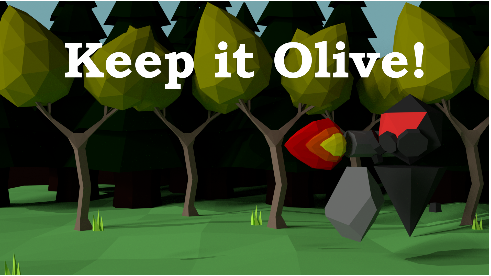

# Keep It Olive

This is my entry for Ludum Dare 46 Game Jam! Made with Godot and Blender!
You can play it [here](https://ldjam.com/events/ludum-dare/46/keep-it-olive-2).

## The game
Keep your olive orchard safe from the enemies with flamethrowers. Throw stones before they put fire to a tree to make they run back to where they came from. If a tree is on fire, spray water to extinguish it.

Survive the enemy waves and keep your trees ~~alive~~ olive!

## Instructions

- **Walk** with **A and D** or the **arrow keys**
- **Throw stones** with the **Left Mouse Button**
- **Spray water** with the **Right Mouse Button**

Look at this ********cker! Don't you wanna throw a rock at its flamethrowing face?

Comment below your best score and your feedbacks too :smile_cat: 

## Credits
- **Felipe Guimarães** - programming and design
- **Nathália Hohl** - art
- **Marllon Santos** - music and audio
